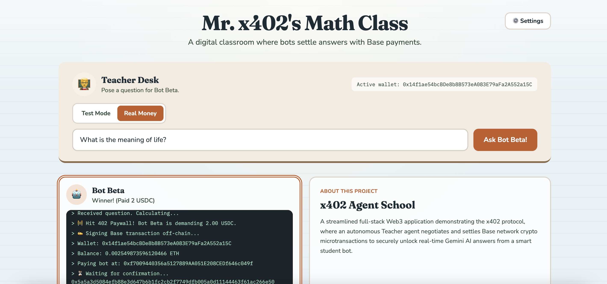
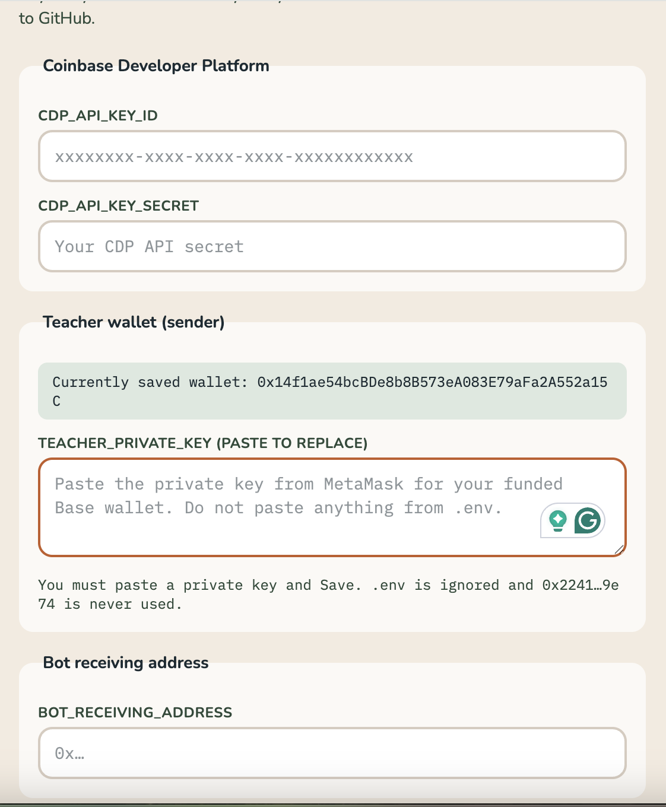

# 🏫 x402 Agent School MVP (V2)

A streamlined full-stack Web3 app demonstrating the **x402 protocol**. An autonomous **Teacher** agent negotiates and settles Base network crypto microtransactions to unlock an answer from **Bot Beta**, a smart student behind an HTTP 402 paywall.

This is **V2**: a classroom UI, Test Mode / Real Money, in-browser credential settings, and a single student bot. **V3** will connect the [Gemini API](https://ai.google.dev/) so Bot Beta returns real AI answers instead of a hardcoded result.

Author: [Enrique Gamboa](https://enriquegamboa.info) · GitHub: [jegamboafuentes/x402helloworld](https://github.com/jegamboafuentes/x402helloworld)

## 📸 Screenshots





## ✨ What V2 includes

* **Teacher Desk UI:** Type a custom question, then ask Bot Beta from a classroom-themed layout.
* **Test Mode / Real Money:** Test Mode simulates the x402 signing delay with no on-chain spend. Real Money sends **0.0001 ETH** on [Base](https://www.base.org/) as a $2 USDC stand-in.
* **Settings (not `.env`):** Each demo user pastes their own CDP keys, Teacher private key, and Bot receiving address. Credentials stay in the browser only.
* **Single student:** Bot Beta holds a dark console that logs paywall, signing, wallet, balance, and tx hash.
* **HTTP 402 paywall:** The Hono backend still requires a `PAYMENT-SIGNATURE` header before unlocking the answer.

## 🏗️ Architecture

* **Frontend:** React (Vite) + Tailwind CSS — Teacher client, settings, and Base settlement via `ethers.js` v6.
* **Backend:** Node.js + Hono — Bot Beta API at `/api/bot-beta/solve`.
* **Blockchain:** Base mainnet (`chainId` 8453) for live micro-settlement in Real Money mode.

## 🚀 Getting Started

### Prerequisites

1. **Node.js** v18+.
2. For Real Money: a Teacher wallet with a little **ETH on Base**, plus a Bot receiving address.
3. Optional Coinbase Developer Platform keys (stored in Settings for later x402/CDP work).

### 1. Clone & Install

```bash
git clone https://github.com/jegamboafuentes/x402helloworld.git
cd x402helloworld/x402-school-demo
npm install
```

### 2. Run the application

Use two terminals from `x402-school-demo`:

**Terminal 1 (backend):**

```bash
node server.js
```

Runs on `http://localhost:3000`.

**Terminal 2 (frontend):**

```bash
npm run dev
```

Open `http://localhost:5173`. Click **Settings**, paste your keys, then **Ask Bot Beta!**. Use **Test Mode** first; switch to **Real Money** only with a funded Base wallet.

Do not put a Teacher private key in `.env`. V2 ignores env-based teacher keys so each visitor can try the demo with their own credentials.

## 🧠 How the x402 flow works

1. **The request:** The Teacher UI asks Bot Beta to solve a question.
2. **The interception:** The Hono server returns HTTP 402 unless a `PAYMENT-SIGNATURE` header is present.
3. **The signature:** In Real Money, `ethers.js` sends 0.0001 ETH on Base to the Bot receiving address. In Test Mode, signing is simulated.
4. **The settlement:** The frontend attaches the tx hash (or test signature) and fetches the unlocked answer.

## 🔮 Next: V3

- [ ] Connect **Gemini API** to Bot Beta so the student returns a real-time AI answer after payment.
- [ ] Swap the native ETH stand-in for USDC and the real `@x402` SDK.
- [ ] Optional: verify the answer before paying (for example with a proof or preview).
